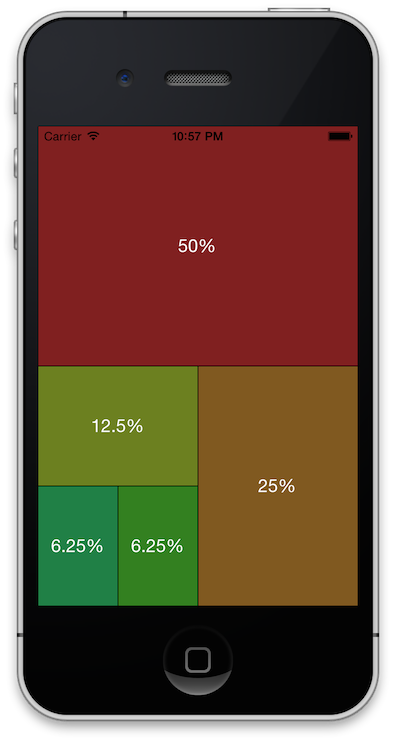

MWProportionalLayoutView
========================

A UIView subclass managing subviews.  Size and position is calculated according to given weights.

## Requirements

`MWProportionalLayoutView` was written for ARC and requires iOS 7.0+ (but it should also work on earlier versions). 

## Usage

An example of the usage can be seen in the ```MWProportionalLayoutView-Example```-Folder. But currently usage is quite simple:

```obj-c

NSArray *myListOfViews = @[[UIView new], [UIView new], [UIView new]];
NSArray *myListOfWeights = @[@(4), @(2), @(1)];

MWProportionalLayoutView *layoutView = [[MWProportionalLayoutView alloc] initWithFrame:myFrame];

[layoutView setSubviews:myListOfViews withWeights:myListOfWeights];

```

In a real world example it would make sense to configure a different look on the views (e.g. background color, labels, etc).

This is, what the example application looks like :



## Layout Algorithm

The current layout algorithm is fixed, but I surely will add some configuration to exchange/configure it later on.

It works in the following way:
1. Sort views by their weight
2. Pop top-most view/weight
3. Set rectangle to the whole area
4. Is the rectangle wider than tall?
5. If Yes: split up horizontally by percentage given by the weight
6. If No: split up vertically by percentage given by the weight
7. The rectangle is whatever not taken by the view
8. Goto 4
